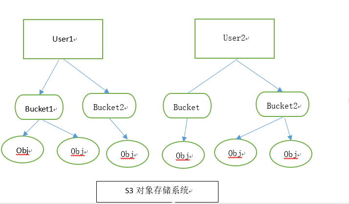
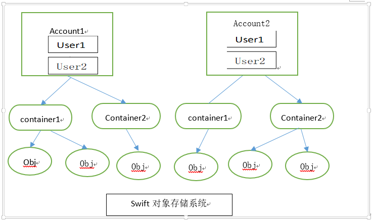
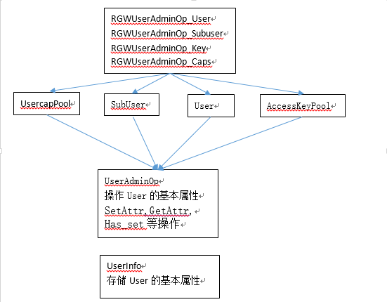

## User结构分析

### User简介

user部分的问题在于Amazon和OpenStack对于user的定义不同。  
Amazon S3的基础数据实体包含user、bucket、object，与用户、存储桶、对象完全对应，如下图：  

而swift将用户概念分为account和user，其中，**account对应一个项目或者租户，每一个account可以被多个user共享**，其他的基础实体比如container和object与以上的存储桶、对象概念相符。如下图：  

RGW为了兼容S3和Swift接口，在设计上需要兼顾两者。因此**RGW将用户分为user和subuser**，其中**user对应S3的user，subuser对应swift的user**。在Jewel版本之前，RGW用户不允许重名，且不同用户下的存储桶名称不能相同，**因此Jewel版本引入了租户（tenant）的概念，目的是为了在不同租户下支持相同名称的用户和存储桶**，同时兼容了之前的版本，允许创建用户时不指定租户，所有不指定租户的用户默认属于同一租户。  

用户的管理设计主要考虑方面：首先是为了对RESTful API进行请求认证，其次为了控制用户对资源（存储桶、对象等）的访问权限，最后是为了控制用户的可用存储空间，因此一个用户包含的信息包括用户认证信息，访问控制权限信息和配额信息。  
RGW对S3 API和Swift API采用不同的认证机制：  
**此处应该有认证机制的介绍**  
通过身份认证后，还需要进行权限访问检查（读写改删，不仅是user，还包括subuser）。  
为了防止某些用户占用太多的存储空间导致其他用户无空间使用，以及方便应用根据付费情况给不同的用户配置不同的存储空间（类似于网盘的VIP），RGW允许对用于进行配额限制，并且会在上传/删除对象时做对应的配额检查。  
通过上述分析，我们可以大致得到以下信息：一个用户所包含的关键属性：用户认证所需要的ID和秘钥，控制资源访问需要用到用户权限以及用户配额信息。  

### 基础结构

#### RGWUserInfo

RGWUserInfo位于rgw_common.h，便于外部直接使用该结构体，所以放到了common中。  

    ```
    struct rgw_user 
    {
        std::string tenant;   //租户，创建用户时指定，不指定租户的user默认属于同一租户
        std::string id;       //用户指定
    }
    struct RGWAccessKey 
    {
        string id;            // AccessKey
        string key;           // SecretKey
        string subuser;       // 
    }
    struct RGWSubUser 
    {
        string name;          // subuer name
        uint32_t perm_mask;   // subuser访问权限：read,write,readwrite,full-control
    }
    class RGWUserCaps
    {
        //string 指的是用户可以访问的资源：users,buckets,metdata,usage,mdlog,datalog,opstate,bilog
        //u32值得是用户对该资源有什么权限：read,write,或者是组合
        //比如，一个用户的caps设置为"users=read",表明该用户具有查询其他用户信息的权限
        map<string, uint32_t> caps;
    }
    struct RGWQuotaInfo 
    {
        //中间省略了部分内容，有待后续研究 
        public:
            int64_t max_size;      //最大值
            int64_t max_objects;   //对象最大个数
            bool enabled;          //配额是否生效
    }
    struct RGWUserInfo 
    {
        rgw_user user_id;                       //user_id,租户可以不指定，因此和id放到了一起，组成机构体
        string display_name;                    //显示名称
        string user_email;                      //email地址
        map<string, RGWAccessKey> access_keys;  //string：用户访问秘钥，用户身份认证时使用；key：用户私有秘钥，用户身份认证时使用
        map<string, RGWAccessKey> swift_keys;   //string：子用户ID，创建subuser时指定；key：subuser私有秘钥
        map<string, RGWSubUser> subusers;       //
        __u8 suspended;                         //用户被暂停访问
        int32_t max_buckets;                    //用户可以创建桶的最大数目
        uint32_t op_mask;                       //用户操作权限read,write,delete，可以是多种权限的组合
        RGWUserCaps caps;                       //用户权限
        __u8 admin;
        __u8 system;
        rgw_placement_rule default_placement;
        list<string> placement_tags;
        RGWQuotaInfo bucket_quota;              //桶配额
        map<int, string> temp_url_keys;
        RGWQuotaInfo user_quota;                //用户配额
        uint32_t type;
        set<string> mfa_ids;
        string assumed_role_arn;
    }
    ```

RGW将用户信息保存在RADOS对象的数据部分，一个用户对应一个RADOS对象。大部分情况下，我们需要使用用户ID作为索引获取用户信息，因此该对象以用户ID命名，（RADOS通过"pool_name+obj_name"查询对象，在pool_name已知的情况下，只需要知道obj_name就可以索引到对应的对象）。  
由于认证过程中需要使用用户访问秘钥、subuser作为索引读取yoghurt信息，并且在设置bucket和object的访问权限时，允许将bucket和object的访问权限授予email为xxx的用户，在对操作进行权限检查的时候需要使用email作为索引获取用户信息。因此需要建立访问秘钥、subuser、email和用户信息所在的RADOS对象的索引关系。针对这种情况，RGW采用了二级索引的实现方式，即分别创建以用户访问秘钥、subuser、email命名的三个RADOS对象，并将用户ID保存在对象的数据部分。当需要使用某个索引查询用户信息时，首先从索引对象中读出用户ID，然后以ID作为索引，读取用户信息。  

#### RGWUserAdminOpState

用户信息的get and set  
support the creation of an RESTful administrative API  
暂时不太明白为什么有些属性再次声明了一遍~  

    ```
    struct RGWUserAdminOpState
    {
        // user attributes
        RGWUserInfo info;
        rgw_user user_id;
        std::string user_email;
        std::string display_name;
        int32_t max_buckets;
        __u8 suspended;
        __u8 admin;
        __u8 system;
        __u8 exclusive;
        __u8 fetch_stats;
        __u8 sync_stats;
        std::string caps;
        RGWObjVersionTracker objv;
        uint32_t op_mask;
        map<int, string> temp_url_keys;

        // subuser attributes
        std::string subuser;
        uint32_t perm_mask;

        // key_attributes
        std::string id; // access key
        std::string key; // secret key
        int32_t key_type;

        std::set<string> mfa_ids;

        // operation attributes
        bool existing_user;
        bool existing_key;
        bool existing_subuser;
        bool existing_email;
        bool subuser_specified;
        bool gen_secret;
        bool gen_access;
        bool gen_subuser;
        bool id_specified;
        bool key_specified;
        bool type_specified;
        bool key_type_setbycontext;   // key type set by user or subuser context
        bool purge_data;
        bool purge_keys;
        bool display_name_specified;
        bool user_email_specified;
        bool max_buckets_specified;
        bool perm_specified;
        bool op_mask_specified;
        bool caps_specified;
        bool suspension_op;
        bool admin_specified = false;
        bool system_specified;
        bool key_op;
        bool temp_url_key_specified;
        bool found_by_uid; 
        bool found_by_email;  
        bool found_by_key;
        bool mfa_ids_specified;
        
        // req parameters
        bool populated;
        bool initialized;
        bool key_params_checked;
        bool subuser_params_checked;
        bool user_params_checked;

        bool bucket_quota_specified;
        bool user_quota_specified;

        RGWQuotaInfo bucket_quota;
        RGWQuotaInfo user_quota;

        // req parameters for listing user
        std::string marker;
        uint32_t max_entries;
    }
    ```

#### RGWAccessKeyPool

对秘钥的一些操作：生成，检查，修改等

    ```
    class RGWAccessKeyPool
    {
        RGWUser *user;

        std::map<std::string, int, ltstr_nocase> key_type_map;
        rgw_user user_id;
        RGWRados *store;

        map<std::string, RGWAccessKey> *swift_keys;
        map<std::string, RGWAccessKey> *access_keys;

        // we don't want to allow keys for the anonymous user or a null user
        bool keys_allowed;  //匿名用户和NULL用户 is not allowed

        private:
            int create_key(RGWUserAdminOpState& op_state, std::string *err_msg = NULL);
            int generate_key(RGWUserAdminOpState& op_state, std::string *err_msg = NULL);
            int modify_key(RGWUserAdminOpState& op_state, std::string *err_msg = NULL);

            int check_key_owner(RGWUserAdminOpState& op_state);
            bool check_existing_key(RGWUserAdminOpState& op_state);
            int check_op(RGWUserAdminOpState& op_state, std::string *err_msg = NULL);

            /* API Contract Fulfilment */
            int execute_add(RGWUserAdminOpState& op_state, std::string *err_msg, bool defer_save);
            int execute_remove(RGWUserAdminOpState& op_state, std::string *err_msg, bool defer_save);
            int remove_subuser_keys(RGWUserAdminOpState& op_state, std::string *err_msg, bool defer_save);

            int add(RGWUserAdminOpState& op_state, std::string *err_msg, bool defer_save);
            int remove(RGWUserAdminOpState& op_state, std::string *err_msg, bool defer_save);
        public:
            explicit RGWAccessKeyPool(RGWUser* usr);
            ~RGWAccessKeyPool();

            int init(RGWUserAdminOpState& op_state);

            /* API Contracted Methods */
            int add(RGWUserAdminOpState& op_state, std::string *err_msg = NULL);
            int remove(RGWUserAdminOpState& op_state, std::string *err_msg = NULL);

            friend class RGWUser;
            friend class RGWSubUserPool;
    };
    ```

#### RGWSubUser

对SubUser的一些操作  

    ```
    class RGWSubUserPool
    {
        RGWUser *user;

        rgw_user user_id;
        RGWRados *store;
        bool subusers_allowed;

        map<string, RGWSubUser> *subuser_map;

        private:
            int check_op(RGWUserAdminOpState& op_state, std::string *err_msg = NULL);

            /* API Contract Fulfillment */
            int execute_add(RGWUserAdminOpState& op_state, std::string *err_msg, bool defer_save);
            int execute_remove(RGWUserAdminOpState& op_state, std::string *err_msg, bool defer_save);
            int execute_modify(RGWUserAdminOpState& op_state, std::string *err_msg, bool defer_save);

            int add(RGWUserAdminOpState& op_state, std::string *err_msg, bool defer_save);
            int remove(RGWUserAdminOpState& op_state, std::string *err_msg, bool defer_save);
            int modify(RGWUserAdminOpState& op_state, std::string *err_msg, bool defer_save);
        public:
            explicit RGWSubUserPool(RGWUser *user);
            ~RGWSubUserPool();

            bool exists(std::string subuser);
            int init(RGWUserAdminOpState& op_state);

            /* API contracted methods */
            int add(RGWUserAdminOpState& op_state, std::string *err_msg = NULL);
            int remove(RGWUserAdminOpState& op_state, std::string *err_msg = NULL);
            int modify(RGWUserAdminOpState& op_state, std::string *err_msg = NULL);

            friend class RGWUser;
    };
    ```

#### RGWUserCapPool

对用户权限的一些操作  

    ```
    class RGWUserCapPool
    {
        RGWUserCaps *caps;
        bool caps_allowed;
        RGWUser *user;

        private:
            int add(RGWUserAdminOpState& op_state, std::string *err_msg, bool defer_save);
            int remove(RGWUserAdminOpState& op_state, std::string *err_msg, bool defer_save);

        public:
            explicit RGWUserCapPool(RGWUser *user);
            ~RGWUserCapPool();

            int init(RGWUserAdminOpState& op_state);

            /* API contracted methods */
            int add(RGWUserAdminOpState& op_state, std::string *err_msg = NULL);
            int remove(RGWUserAdminOpState& op_state, std::string *err_msg = NULL);

            friend class RGWUser;
    };
    ```

#### RGWUser

对用户的一些操作

    ```
    class RGWUser
    {
        private:
            RGWUserInfo old_info;    //保存上一次的用户信息
            RGWRados *store;

            rgw_user user_id;
            bool info_stored;

            void set_populated() { info_stored = true; }
            void clear_populated() { info_stored = false; }
            bool is_populated() { return info_stored; }

            int check_op(RGWUserAdminOpState&  req, std::string *err_msg);
            int update(RGWUserAdminOpState& op_state, std::string *err_msg);

            void clear_members();
            void init_default();

            /* API Contract Fulfillment */
            int execute_add(RGWUserAdminOpState& op_state, std::string *err_msg);
            int execute_remove(RGWUserAdminOpState& op_state, std::string *err_msg);
            int execute_modify(RGWUserAdminOpState& op_state, std::string *err_msg);

        public:
            RGWUser();
            ~RGWUser();

            int init(RGWRados *storage, RGWUserAdminOpState& op_state);

            int init_storage(RGWRados *storage);
            int init(RGWUserAdminOpState& op_state);
            int init_members(RGWUserAdminOpState& op_state);

            RGWRados *get_store() { return store; }

            /* API Contracted Members */
            RGWUserCapPool caps;
            RGWAccessKeyPool keys;
            RGWSubUserPool subusers;

            /* API Contracted Methods */
            int add(RGWUserAdminOpState& op_state, std::string *err_msg = NULL);
            int remove(RGWUserAdminOpState& op_state, std::string *err_msg = NULL);

            /* remove an already populated RGWUser */
            int remove(std::string *err_msg = NULL);

            int modify(RGWUserAdminOpState& op_state, std::string *err_msg = NULL);

            /* retrieve info from an existing user in the RGW system */
            int info(RGWUserAdminOpState& op_state, RGWUserInfo& fetched_info, std::string *err_msg = NULL);

            /* info from an already populated RGWUser */
            int info (RGWUserInfo& fetched_info, std::string *err_msg = NULL);

            /* list the existing users */
            int list(RGWUserAdminOpState& op_state, RGWFormatterFlusher& flusher);

            friend class RGWAccessKeyPool;
            friend class RGWSubUserPool;
            friend class RGWUserCapPool;
    };
    ```

#### admin API

Wrappers for admin API functionality  

```
class RGWUserAdminOp_User
{
    public:
        static int list(RGWRados *store,
                        RGWUserAdminOpState& op_state, RGWFormatterFlusher& flusher);
        static int info(RGWRados *store,
                        RGWUserAdminOpState& op_state, RGWFormatterFlusher& flusher);
        static int create(RGWRados *store,
                        RGWUserAdminOpState& op_state, RGWFormatterFlusher& flusher);
        static int modify(RGWRados *store,
                        RGWUserAdminOpState& op_state, RGWFormatterFlusher& flusher);
        static int remove(RGWRados *store,
                        RGWUserAdminOpState& op_state, RGWFormatterFlusher& flusher);
};

class RGWUserAdminOp_Subuser
{
    public:
        static int create(RGWRados *store,
                        RGWUserAdminOpState& op_state, RGWFormatterFlusher& flusher);
        static int modify(RGWRados *store,
                        RGWUserAdminOpState& op_state, RGWFormatterFlusher& flusher);
        static int remove(RGWRados *store,
                        RGWUserAdminOpState& op_state, RGWFormatterFlusher& flusher);
};

class RGWUserAdminOp_Key
{
    public:
        static int create(RGWRados *store,
                        RGWUserAdminOpState& op_state, RGWFormatterFlusher& flusher);
        static int remove(RGWRados *store,
                        RGWUserAdminOpState& op_state, RGWFormatterFlusher& flusher);
};

class RGWUserAdminOp_Caps
{
    public:
        static int add(RGWRados *store,
                RGWUserAdminOpState& op_state, RGWFormatterFlusher& flusher);
        static int remove(RGWRados *store,
                RGWUserAdminOpState& op_state, RGWFormatterFlusher& flusher);
};

class RGWMetadataManager;
```

### 调用流程

以OPT_USER_CREATE为例，进行分析：  

1. 声明变量

操作变量是RGWUserAdminOpState。

```
RGWUserAdminOpState user_op;
rgw_user user_id;
string tenant;
std::string access_key, secret_key, user_email, display_name;
//do something
```

2. 根据参数进行属性设置

根据命令中的参数，进行提取  

```
for (std::vector<const char*>::iterator i = args.begin(); i != args.end(); )
{
    if (ceph_argparse_double_dash(args, i)) {
        break;
    }
    else if (ceph_argparse_witharg(args, i, &val, "-i", "--uid", (char*)NULL))
    {
        user_id.from_str(val);
    }
    else if (ceph_argparse_witharg(args, i, &val, "--tenant", (char*)NULL))
    {
        tenant = val;
    }
    else if (ceph_argparse_witharg(args, i, &val, "--access-key", (char*)NULL))
    {
        access_key = val;
    }
    else if (ceph_argparse_witharg(args, i, &val, "--subuser", (char*)NULL))
    {
        subuser = val;
    }
    else if (ceph_argparse_witharg(args, i, &val, "--secret", "--secret-key", (char*)NULL))
    {
        secret_key = val;
    }
    else if (ceph_argparse_witharg(args, i, &val, "-e", "--email", (char*)NULL))
    {
        user_email = val;
        user_op.user_email_specified=true;
    }
    else{
        //do something
    }
}

/* user and bucket属性设置 */
if (!user_id.empty()) {
    user_op.set_user_id(user_id);
    bucket_op.set_user_id(user_id);
}

if (!display_name.empty())
    user_op.set_display_name(display_name);

if (!user_email.empty())
    user_op.set_user_email(user_email);

if (!access_key.empty())
    user_op.set_access_key(access_key);

if (!secret_key.empty())
    user_op.set_secret_key(secret_key);
//do something
```

3. 接口调用

```
case OPT_USER_CREATE:
    if (!user_op.has_existing_user())
    {
        user_op.set_generate_key(); // generate a new key by default
    }
    /* RGWUser user; */
    ret = user.add(user_op, &err_msg);      //调用add函数
    if (ret < 0)
    {
        cerr << "could not create user: " << err_msg << std::endl;
        if (ret == -ERR_INVALID_TENANT_NAME)
            ret = -EINVAL;

        return -ret;
    }
    if (!subuser.empty())
    {
        /* RGWUser user; RGWSubUserPool subusers; */
        ret = user.subusers.add(user_op, &err_msg);      //调用add函数
        if (ret < 0)
        {
            cerr << "could not create subuser: " << err_msg << std::endl;
            return -ret;
        }
    }
    break;
```

4. 内部调用

```
int RGWUser::add(RGWUserAdminOpState& op_state, std::string *err_msg)
{
    std::string subprocess_msg;
    int ret;

    ret = check_op(op_state, &subprocess_msg);      //检查op
    if (ret < 0)
    {
        set_err_msg(err_msg, "unable to parse parameters, " + subprocess_msg);
        return ret;
    }

    ret = execute_add(op_state, &subprocess_msg);      //执行op
    if (ret < 0)
    {
        set_err_msg(err_msg, "unable to create user, " + subprocess_msg);
        return ret;
    }
    return 0;
}
```

### 总结

在User部分出现的类和结构体，之间的关系大致如下图：


不过adminAPI的作用尚未明白，参数不同，还没找到哪个地方用到了，有待后续研究。  
