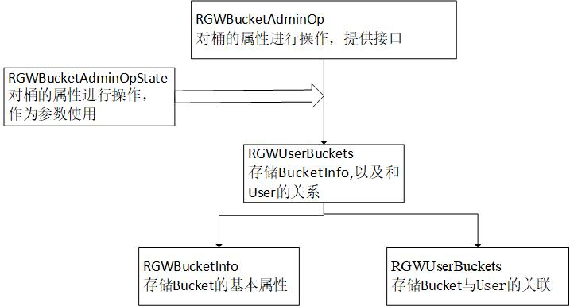

### bucket简介

一个存储桶对应一个RADOS对象，一个存储桶包含的信息分为两类：
    一类是对RGW网关透明的信息，这类信息通畅是指用户自定义的元数据，用户自定义的元数据通常以KV键值对组成，比如用户可以自定义TYPE类型用于区分存储痛下保存的对象类型，RGW不关心这些信息的内容，直接将这些信息保存在对象的扩展属性中，一个KV键值对，对应一个扩展属性条目；  
    一类是RGW网关关注的信息，这类信息包括存储桶中对象的存储策略、存储桶中索引对象的数目以及应用对象与索引对象的映射关系、存储桶的配额等，此类信息由数据结构RGWBucketInfo管理，保存在RADOS对象的数据部分。  

### 基础结构

结构图如下：



#### RGWUserBuckets

存储user的桶，用户是否可以操作这个桶，创建用户和桶之间的连接

```
    /**
    * Store a list of the user's buckets, with associated functinos.
    */
    class RGWUserBuckets
    {
        std::map<std::string, RGWBucketEnt> buckets;

        public:

        bool owns(string& name) {
            map<string, RGWBucketEnt>::iterator iter;
            iter = buckets.find(name);
            return (iter != buckets.end());
        }

        /**
        * Add a (created) bucket to the user's bucket list.
        */
        void add(const RGWBucketEnt& bucket) {
            buckets[bucket.bucket.name] = bucket;
        }

        /**
        * Remove a bucket from the user's list by name.
        */
        void remove(const string& name) {
            map<string, RGWBucketEnt>::iterator iter;
            iter = buckets.find(name);
            if (iter != buckets.end()) {
            buckets.erase(iter);
            }
        }

        /**
        * Get the user's buckets as a map.
        */
        map<string, RGWBucketEnt>& get_buckets() { return buckets; }

        /**
        * Cleanup data structure
        */
        void clear() { buckets.clear(); }

        size_t count() { return buckets.size(); }
    };
```

#### RGWBucketAdminOpState

rgw_bucket:描述桶的基本信息
RGWQuotaInfo：桶配额
RGWBucketAdminOpState:描述桶的信息以及用户信息，包括一些基础的操作：set 和 get

```
    struct rgw_bucket {
        std::string tenant;
        std::string name;
        std::string marker;
        std::string bucket_id;
        rgw_data_placement_target explicit_placement;

        std::string oid;
        /*
        * runtime in-memory only info. If not empty, points to the bucket instance object
        */

        rgw_bucket() { }

    };
    struct RGWQuotaInfo {
        template<class T> friend class RGWQuotaCache;
        protected:
        /* The quota thresholds after which comparing against cached storage stats
        * is disallowed. Those fields may be accessed only by the RGWQuotaCache.
        * They are not intended as tunables but rather as a mean to store results
        * of repeating calculations in the quota cache subsystem. */
        int64_t max_size_soft_threshold;
        int64_t max_objs_soft_threshold;

        public:
        int64_t max_size;
        int64_t max_objects;
        bool enabled;
        /* Do we want to compare with raw, not rounded RGWStorageStats::size (true)
        * or maybe rounded-to-4KiB RGWStorageStats::size_rounded (false)? */
        bool check_on_raw;

        RGWQuotaInfo()
            : max_size_soft_threshold(-1),
            max_objs_soft_threshold(-1),
            max_size(-1),
            max_objects(-1),
            enabled(false),
            check_on_raw(false) {
        }

        void dump(Formatter *f) const;
        void decode_json(JSONObj *obj);
    };

    struct RGWBucketAdminOpState {
        rgw_user uid;
        std::string display_name;
        std::string bucket_name;
        std::string bucket_id;
        std::string object_name;

        bool list_buckets;
        bool stat_buckets;
        bool check_objects;
        bool fix_index;
        bool delete_child_objects;
        bool bucket_stored;
        int max_aio = 0;

        rgw_bucket bucket;
        RGWQuotaInfo quota;
        
        //function:
        //set some param
        //get some pram
        //get bool
    };
```

#### RGWBucketInfo

```
    struct RGWBucketInfo {
        enum BIShardsHashType {
            MOD = 0
        };

        rgw_bucket bucket;
        rgw_user owner;
        uint32_t flags;
        string zonegroup;
        ceph::real_time creation_time;     /* 创建时间 */
        /* 存储桶中对象的存储策略：关系到用户上传的对象，bucket索引对象，分段上传对象时产生的中间数据存放的存储池。
           存储桶的存储策略在存储桶创建时指定，创建后将不能修改 */
        rgw_placement_rule placement_rule;
        bool has_instance_obj;
        RGWObjVersionTracker objv_tracker; /* we don't need to serialize this, for runtime tracking */
        obj_version ep_objv;               /* entry point object version, for runtime tracking only */
        RGWQuotaInfo quota;                /* 配额 */

        // Represents the number of bucket index object shards:
        //   - value of 0 indicates there is no sharding (this is by default before this
        //     feature is implemented).
        //   - value of UINT32_T::MAX indicates this is a blind bucket.
        uint32_t num_shards; //索引对象数目

        // Represents the bucket index shard hash type.
        /* 当一个存储桶对应多个索引对象时，计算某个对象由哪个索引对象保存的算法，目前只支持一种算法 */
        /* 索引对象 = hash(obj_name)%num_shards*/
        uint8_t bucket_index_shard_hash_type;

        // Represents the shard number for blind bucket.
        const static uint32_t NUM_SHARDS_BLIND_BUCKET;

        bool requester_pays;

        bool has_website;
        RGWBucketWebsiteConf website_conf;
        /*
        0：当创建一个存储桶时，同时创建一个或多个索引对象，并且在有应用对象更新时，将对象记录在其中一个索引对象中。
        1：当创建一个存储桶时，同时创建一个或多个索引对象，但是在有应用对象更新时，不记录对象。
         */
        RGWBucketIndexType index_type = RGWBIType_Normal;

        bool swift_versioning;
        string swift_ver_location;

        map<string, uint32_t> mdsearch_config;

        /* resharding */
        uint8_t reshard_status;
        string new_bucket_instance_id;

        RGWBucketInfo(){}
    };
```

#### RGWBucket

RGWBucket:又是包了一层？

```
    /*
    * A simple wrapper class for administrative bucket operations
    */

    class RGWBucket
    {
        RGWUserBuckets buckets;
        RGWRados *store;
        RGWAccessHandle handle; //typedef void* RGWAccessHandle

        RGWUserInfo user_info;  //user info
        std::string tenant;
        std::string bucket_name;

        bool failure;

        RGWBucketInfo bucket_info;

        public:
        RGWBucket() : store(NULL), handle(NULL), failure(false) {}
        int init(RGWRados *storage, RGWBucketAdminOpState& op_state);

        int check_bad_index_multipart(RGWBucketAdminOpState& op_state,
                    RGWFormatterFlusher& flusher, std::string *err_msg = NULL);

        int check_object_index(RGWBucketAdminOpState& op_state,
                                RGWFormatterFlusher& flusher,
                                std::string *err_msg = NULL);

        int check_index(RGWBucketAdminOpState& op_state,
                map<RGWObjCategory, RGWStorageStats>& existing_stats,
                map<RGWObjCategory, RGWStorageStats>& calculated_stats,
                std::string *err_msg = NULL);

        int remove(RGWBucketAdminOpState& op_state, bool bypass_gc = false, bool keep_index_consistent = true, std::string *err_msg = NULL);
        int link(RGWBucketAdminOpState& op_state, std::string *err_msg = NULL);
        int unlink(RGWBucketAdminOpState& op_state, std::string *err_msg = NULL);
        int set_quota(RGWBucketAdminOpState& op_state, std::string *err_msg = NULL);

        int remove_object(RGWBucketAdminOpState& op_state, std::string *err_msg = NULL);
        int policy_bl_to_stream(bufferlist& bl, ostream& o);
        int get_policy(RGWBucketAdminOpState& op_state, RGWAccessControlPolicy& policy);

        void clear_failure() { failure = false; }

        const RGWBucketInfo& get_bucket_info() const { return bucket_info; }
    };
```

#### RGWBucketAdminOp

RGWBucketAdminOp：操作接口，传rados对象

```
    class RGWBucketAdminOp
    {
        public:
        /*权限*/
        static int get_policy(RGWRados *store, RGWBucketAdminOpState& op_state,
                        RGWFormatterFlusher& flusher);
        static int get_policy(RGWRados *store, RGWBucketAdminOpState& op_state,
                        RGWAccessControlPolicy& policy);
        static int dump_s3_policy(RGWRados *store, RGWBucketAdminOpState& op_state,
                        ostream& os);

        static int unlink(RGWRados *store, RGWBucketAdminOpState& op_state);
        static int link(RGWRados *store, RGWBucketAdminOpState& op_state, string *err_msg = NULL);

        static int check_index(RGWRados *store, RGWBucketAdminOpState& op_state,
                        RGWFormatterFlusher& flusher);

        static int remove_bucket (RGWRados *store, RGWBucketAdminOpState& op_state,
                                  bool bypass_gc = false, bool keep_index_consistent = true);
        static int remove_object(RGWRados *store, RGWBucketAdminOpState& op_state);
        static int info(RGWRados *store, RGWBucketAdminOpState& op_state, RGWFormatterFlusher& flusher);
        static int limit_check(RGWRados *store, RGWBucketAdminOpState& op_state,
                    const std::list<std::string>& user_ids,
                    RGWFormatterFlusher& flusher,
                    bool warnings_only = false);
        static int set_quota(RGWRados *store, RGWBucketAdminOpState& op_state);

        static int list_stale_instances(RGWRados *store, RGWBucketAdminOpState& op_state,
                        RGWFormatterFlusher& flusher);

        static int clear_stale_instances(RGWRados *store, RGWBucketAdminOpState& op_state,
                        RGWFormatterFlusher& flusher);
        static int fix_lc_shards(RGWRados *store, RGWBucketAdminOpState& op_state,
                                RGWFormatterFlusher& flusher);
        static int fix_obj_expiry(RGWRados *store, RGWBucketAdminOpState& op_state,
                        RGWFormatterFlusher& flusher, bool dry_run = false);
    };
```

#### RGWDataChangesLog

RGWDataChangesLog:数据变化记录，应该是起线程检测。  
太NM复杂了  

```
    struct rgw_data_change {
        DataLogEntityType entity_type;
        string key;
        real_time timestamp;
    };

    struct rgw_data_change_log_entry {
        string log_id;
        real_time log_timestamp;
        rgw_data_change entry;
    };

    struct RGWDataChangesLogInfo {
        string marker;
        real_time last_update;

        void dump(Formatter *f) const;
        void decode_json(JSONObj *obj);
    };

    /// 用于通知trim process有关哪些存储桶最活跃的接口（不太懂）
    /// 检测trim process过程中，桶的活跃程度
    /// Interface to inform the trim process about which buckets are most active
    struct BucketChangeObserver {
        virtual ~BucketChangeObserver() = default;

        virtual void on_bucket_changed(const boost::string_view& bucket_instance) = 0;
    };
    namespace rgw {
        struct BucketChangeObserver;
    }

    class RGWDataChangesLog {
        CephContext *cct;
        RGWRados *store;
        rgw::BucketChangeObserver *observer = nullptr;

        int num_shards;
        string *oids;

        Mutex lock;
        RWLock modified_lock;
        map<int, set<string> > modified_shards;

        struct ChangeStatus {
            real_time cur_expiration;
            real_time cur_sent;
            bool pending;
            RefCountedCond *cond;
            Mutex *lock;

            ChangeStatus() : pending(false), cond(NULL) {
            lock = new Mutex("RGWDataChangesLog::ChangeStatus");
            }

            ~ChangeStatus() {
            delete lock;
            }
        };

        void set_observer(rgw::BucketChangeObserver *observer) {
            this->observer = observer;
        }
    };

```

\


#### rgw_raw_obj

```
struct rgw_pool {
  std::string name;
  std::string ns;
};

struct rgw_raw_obj {
  rgw_pool pool;
  std::string oid;  // object_id?
  std::string loc;  // location?
};
```

#### RGWBucketEntryPoint

bucket 和 user 建立关联

```
struct RGWBucketEntryPoint
{
  rgw_bucket bucket;
  rgw_user owner;
  ceph::real_time creation_time;
  bool linked;   // link relationship

  bool has_bucket_info;
  RGWBucketInfo old_bucket_info;

  RGWBucketEntryPoint() : linked(false), has_bucket_info(false) {}

};
```

### 调用流程

以OPT_BUCKET_LINK为例，进行分析：  
1. 声明变量

```
RGWBucketAdminOpState bucket_op;
```

2. 变量赋值

```
/* user and bucket属性设置 */
  if (!user_id.empty()) {
    user_op.set_user_id(user_id);
    bucket_op.set_user_id(user_id);
  }
  //and so on

  /* populate bucket operation */
  bucket_op.set_bucket_name(bucket_name);
  bucket_op.set_object(object);
  bucket_op.set_check_objects(check_objects);
  bucket_op.set_delete_children(delete_child_objects);
  bucket_op.set_fix_index(fix);
  bucket_op.set_max_aio(max_concurrent_ios);
  
  /*bucket_id*/
  else if (ceph_argparse_witharg(args, i, &val, "--bucket-id", (char*)NULL)) {
      bucket_id = val;
      if (bucket_id.empty()) {
        cerr << "bad bucket-id" << std::endl;
        exit(1);
      }
  }
```

3. 调用
```
  if (opt_cmd == OPT_BUCKET_LINK) {
    bucket_op.set_bucket_id(bucket_id);
    string err;
    int r = RGWBucketAdminOp::link(store, bucket_op, &err);
    if (r < 0) {
      cerr << "failure: " << cpp_strerror(-r) << ": " << err << std::endl;
      return -r;
    }
  }
```
4. 内部实现

```
    int RGWBucketAdminOp::link(RGWRados *store, RGWBucketAdminOpState& op_state, string *err)
    {
        RGWBucket bucket;
        /* 每次对桶的操作都要进行init的检查 */
        int ret = bucket.init(store, op_state);  //见下注释
        if (ret < 0)
            return ret;

        return bucket.link(op_state, err);
    }

    int RGWBucket::init(RGWRados *storage, RGWBucketAdminOpState& op_state)
    {
        if (!storage)
            return -EINVAL;

        store = storage;
        /* 获取参数中的桶信息 */
        rgw_user user_id = op_state.get_user_id();
        tenant = user_id.tenant;
        bucket_name = op_state.get_bucket_name();
        RGWUserBuckets user_buckets;
        auto obj_ctx = store->svc.sysobj->init_obj_ctx();

        if (bucket_name.empty() && user_id.empty())
            return -EINVAL;

        if (!bucket_name.empty()) {
            /* 从rados的信息中，获取bucket_info,如果不能获取，说明该桶没有创建 */
            int r = store->get_bucket_info(obj_ctx, tenant, bucket_name, bucket_info, NULL, null_yield);
            if (r < 0) {
            ldout(store->ctx(), 0) << "could not get bucket info for bucket=" << bucket_name << dendl;
            return r;
            }
            /* 本地赋值 */
            op_state.set_bucket(bucket_info.bucket);
        }

        if (!user_id.empty()) {
            /* 判断user是否存在 */
            int r = rgw_get_user_info_by_uid(store, user_id, user_info);
            if (r < 0)
            return r;

            op_state.display_name = user_info.display_name;
        }

        clear_failure(); // failure=false;
        return 0;
    }

```

5. 具体实现

```
    int RGWBucket::link(RGWBucketAdminOpState& op_state, std::string *err_msg)
    {
        /* 判断桶和用户是否为空*/
        if (!op_state.is_user_op()) {
            set_err_msg(err_msg, "empty user id");
            return -EINVAL;
        }

        string bucket_id = op_state.get_bucket_id();
        if (bucket_id.empty()) {
            set_err_msg(err_msg, "empty bucket instance id");
            return -EINVAL;
        }

        std::string display_name = op_state.get_user_display_name();
        rgw_bucket bucket = op_state.get_bucket();

        const rgw_pool& root_pool = store->svc.zone->get_zone_params().domain_root;
        std::string bucket_entry;
        /* bucket_entry = tenant_name + "/" + bucket_name; */
        rgw_make_bucket_entry_name(tenant, bucket_name, bucket_entry);

        rgw_raw_obj obj(root_pool, bucket_entry);
        RGWObjVersionTracker objv_tracker;    /* 版本识别 */

        map<string, bufferlist> attrs;
        RGWBucketInfo bucket_info;

        auto obj_ctx = store->svc.sysobj->init_obj_ctx();
        /* 获取attrs */
        int r = store->get_bucket_instance_info(obj_ctx, bucket, bucket_info, NULL, &attrs, null_yield);
        if (r < 0) {
            return r;
        }

        /*RGW_ATTR_ACL：Access Control List,访问权限 */
        /* 判断有没有访问权限 */
        map<string, bufferlist>::iterator aiter = attrs.find(RGW_ATTR_ACL);
        if (aiter != attrs.end())
        {
            bufferlist aclbl = aiter->second;
            RGWAccessControlPolicy policy;
            ACLOwner owner;
            try {
            auto iter = aclbl.cbegin();
            decode(policy, iter);
            owner = policy.get_owner();
            } catch (buffer::error& err) {
            set_err_msg(err_msg, "couldn't decode policy");
            return -EIO;
            }

            /* unlink operate */
            r = rgw_unlink_bucket(store, owner.get_id(), bucket.tenant, bucket.name, false);
            if (r < 0) {
            set_err_msg(err_msg, "could not unlink policy from user " + owner.get_id().to_str());
            return r;
            }

            /* 更新桶的用户 */
            /* 更新policy */
            // now update the user for the bucket...
            // do something
        }

        return 0;
    }
```

具体实现（没仔细看，底层东西太多了）：  

```
int rgw_unlink_bucket(RGWRados *store, const rgw_user& user_id, 
                      const string& tenant_name, const string& bucket_name, bool update_entrypoint)
{
  int ret;

  string buckets_obj_id;
  rgw_get_buckets_obj(user_id, buckets_obj_id);

  cls_user_bucket bucket;
  bucket.name = bucket_name;
  rgw_raw_obj obj(store->svc.zone->get_zone_params().user_uid_pool, buckets_obj_id);
  ret = store->cls_user_remove_bucket(obj, bucket);
  if (ret < 0) {
    ldout(store->ctx(), 0) << "ERROR: error removing bucket from directory: "
        << cpp_strerror(-ret)<< dendl;
  }

  if (!update_entrypoint)
    return 0;

  RGWBucketEntryPoint ep;
  RGWObjVersionTracker ot;
  map<string, bufferlist> attrs;
  RGWSysObjectCtx obj_ctx = store->svc.sysobj->init_obj_ctx();
  ret = store->get_bucket_entrypoint_info(obj_ctx, tenant_name, bucket_name, ep, &ot, NULL, &attrs);
  if (ret == -ENOENT)
    return 0;
  if (ret < 0)
    return ret;

  if (!ep.linked)
    return 0;

  if (ep.owner != user_id) {
    ldout(store->ctx(), 0) << "bucket entry point user mismatch, can't unlink bucket: " << ep.owner << " != " << user_id << dendl;
    return -EINVAL;
  }

  ep.linked = false;
  return store->put_bucket_entrypoint_info(tenant_name, bucket_name, ep, false, ot, real_time(), &attrs);
}
```
