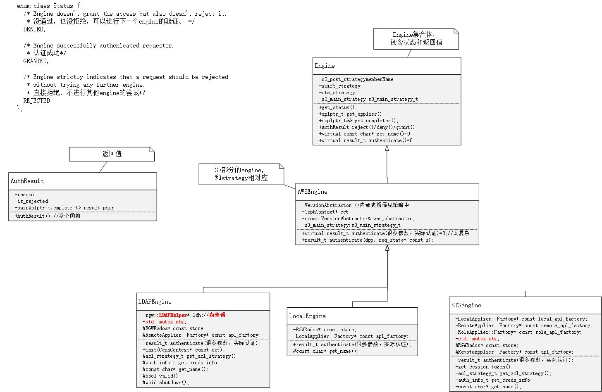
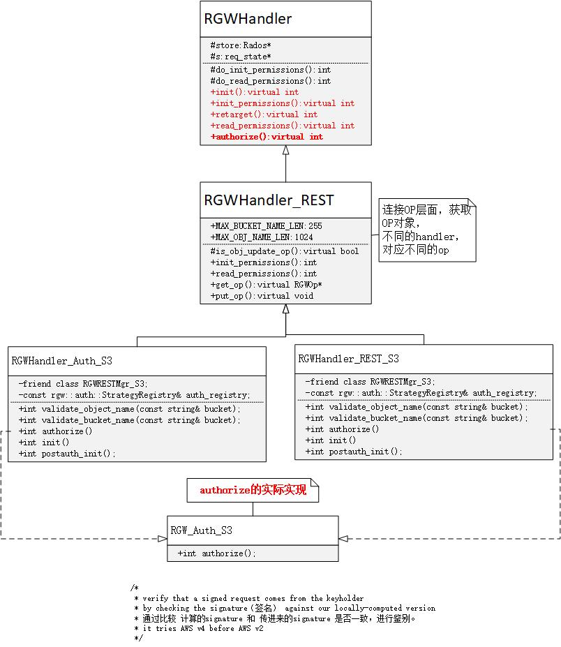
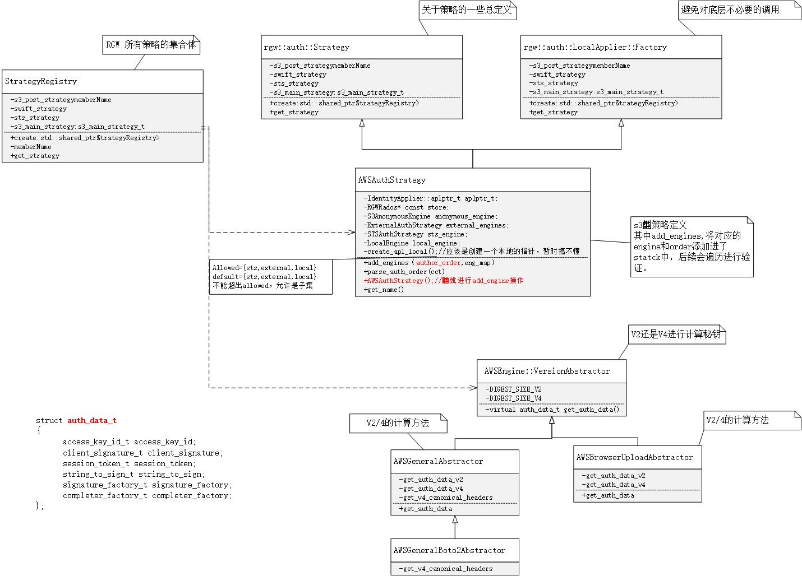

### 认证过程简介

认证的过程是一个对用户信息进行解析并且判断前后得到的秘钥是否一致的过程。  

#### **auth_regitry的创建**  

在rgw_main.cc:main()中进行初始化auth_registry对象  

```
/*rgw_main.cc*/
/* Initialize the registry of auth strategies which will coordinate
* the dynamic reconfiguration. */
auto auth_registry = \
    rgw::auth::StrategyRegistry::create(g_ceph_context, store);
```

#### **very_request()进行认证**

当请求来临的时候，对用户信息进行分析和认证。  

```
/* rgw_process.cc */
ldpp_dout(op, 2) << "verifying requester" << dendl;
ret = op->verify_requester(auth_registry);
```

1. 首选利用用户的req_state进行申请秘钥

如下述代码中：auth_data = ver_abstractor.get_auth_data(s);通过具体的策略进行秘钥（**auth_data.client_signature**）的计算。然后将秘钥和一些其他参数传递到下一个函数。  

```
/* AWSEngine类型的验证。 */
AWSEngine::result_t
AWSEngine::authenticate(const DoutPrefixProvider* dpp, const req_state* const s) const
{
  /* Small reminder: an ver_abstractor is allowed to throw! */
  /* 根据req_state生成auth_data,其中含有秘钥。便于下一步中的authenticate(*****)对比 */
  const auto auth_data = ver_abstractor.get_auth_data(s);

  if (auth_data.access_key_id.empty() ||                auth_data.client_signature.empty()) {
    return result_t::deny(-EINVAL);
  } else {
    /*下述函数是一个多态函数，具体选择和对应的策略一致*/
    return authenticate(dpp,
                        auth_data.access_key_id,
		                auth_data.client_signature,
                        auth_data.session_token,
			            auth_data.string_to_sign,
                        auth_data.signature_factory,
			            auth_data.completer_factory,
			            s);
  }
}
```

2. 再次计算秘钥，进行对比

以LocalEngine::authenticate为例进行分析，**signature.compare(server_signature);** 
```
/* 
 * 执行步骤：
 * 1.rgw_get_user_info_by_access_key，获取用户信息
 * 2.server_signature_t=signature_factory(),生成签名
 * 3.compare，对比
 * */

rgw::auth::Engine::result_t
rgw::auth::s3::LocalEngine::authenticate(
  const DoutPrefixProvider* dpp,
  const boost::string_view& _access_key_id,
  const boost::string_view& signature,
  const boost::string_view& session_token,
  const string_to_sign_t& string_to_sign,
  const signature_factory_t& signature_factory,
  const completer_factory_t& completer_factory,
  const req_state* const s) const
{
  /* get the user info */
  RGWUserInfo user_info;

  /* TODO(rzarzynski): we need to have string-view taking variant. */
  const std::string access_key_id = _access_key_id.to_string();

  const auto iter = user_info.access_keys.find(access_key_id);

  const RGWAccessKey& k = iter->second;

  /* 由签名工厂生成一个签名 */
  const VersionAbstractor::server_signature_t server_signature = \
    signature_factory(cct, k.key, string_to_sign);
  
  auto compare = signature.compare(server_signature);/* 传进来的“签名”参数和生成的签名进行对比  */

  if (compare != 0) {
    return result_t::deny(-ERR_SIGNATURE_NO_MATCH);
  }

  /* what 意思，move的蛋疼…… */
  auto apl = apl_factory->create_apl_local(cct, s, user_info, k.subuser, boost::none);
  return result_t::grant(std::move(apl), completer_factory(k.key));
}
```

### 关键数据结构介绍

#### engine的结构图：
engine的结构图：


#### authorize的结构图：


strategy的结构图：


### 认证流程详细分析

#### 1.创建策略集合

这个步骤是在rgw_main.cc:main中进行。StrategyRegistry是一个策略集合，对应了几种秘钥策略。这些策略和engine相对应，engine负责进行秘钥的计算和匹配。  

```
  /* Initialize the registry of auth strategies which will coordinate
   * the dynamic reconfiguration. */
  auto auth_registry = \
    rgw::auth::StrategyRegistry::create(g_ceph_context, store);
```

#### 2.验证

其中涉及多次多态选择，strategy和engine相互匹配，keystone，swift，s3分别有不同的验证体系，如果想要搞清楚具体之间的关系，还需要慢慢看！  

```
op->verify_requester(auth_registry); //rgw_process.cc
    /*authorize是一个虚函数，由具体的Handler执行*/
    dialect_handler->authorize(this); // rgw_op.h
        /*其实是又是多态，具体见类分析*/
        RGW_Auth_S3::authorize(); //rgw_rest_s3.cc
        rgw::auth::Strategy::apply(dpp, auth_registry.get_s3_main(), s); //实际比较
            /*具体的*/
            auto result = auth_strategy.authenticate(dpp, s);
            rgw::auth::Strategy::authenticate()//还有一个匿名的调用方法，根据具体的strategy进行选择。
            for (const stack_item_t& kv : auth_stack)//遍历auth_stack<engine,control>
                engine.authenticate(dpp, s);//具体的engine进行计算认证。还是多态！
                AWSEngine::authenticate();
                /*根据req_state生成auth_data,其中含有秘钥。便于下一步中的authenticate(*****)对比*/
                auth_data = ver_abstractor.get_auth_data(s);
                /*没错！同名函数！参数不同！而且还是虚函数！！！！*/
                authenticate(dpp,
                            auth_data.access_key_id,    //accesskey
		                    auth_data.client_signature, //签名
                            auth_data.session_token,
			                auth_data.string_to_sign,
                            auth_data.signature_factory, //签名工厂
                            auth_data.completer_factory,
                            s);
                /* 由签名工厂生成一个签名 */
                const VersionAbstractor::server_signature_t server_signature = \
                    signature_factory(cct, k.key, string_to_sign);
                /* 传进来的“签名”参数和生成的签名进行对比  */
                auto compare = signature.compare(server_signature);
```

### 后续

个人认为：认证签名的过程属于边缘功能，但是却融合了OP、Handler和User的相互纠缠关系，真是一个错综复杂，画图分析，抽茧剥丝太难了，很难去像拎葡萄一样，一串就出来了。还需要慢慢磨~  

### 参考文献

[Amazon Simple Storage Service Developer Guide](https://docs.aws.amazon.com/AmazonS3/latest/dev/s3-dg.pdf)
[Amazon Simple Storage Service API Reference](https://docs.aws.amazon.com/AmazonS3/latest/API/s3-api.pdf)
[RGW LDAP Authentication](http://docs.ceph.com/docs/master/radosgw/ldap-auth/)
[Ceph RGW的身份验证代码概览](http://sealblog.com/2018/03/02/rgw-auth/)
[Ceph浅析（中）：结构、工作原理及流程](https://my.oschina.net/wdyoschina/blog/709198)